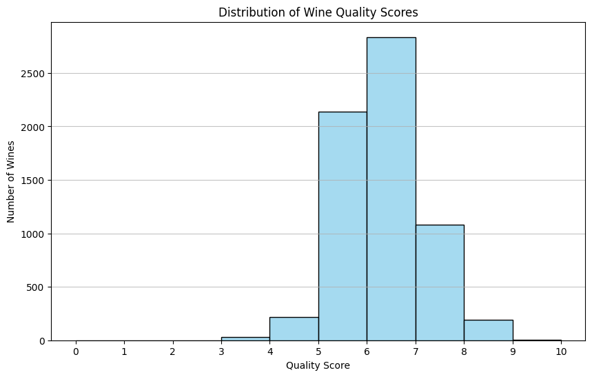
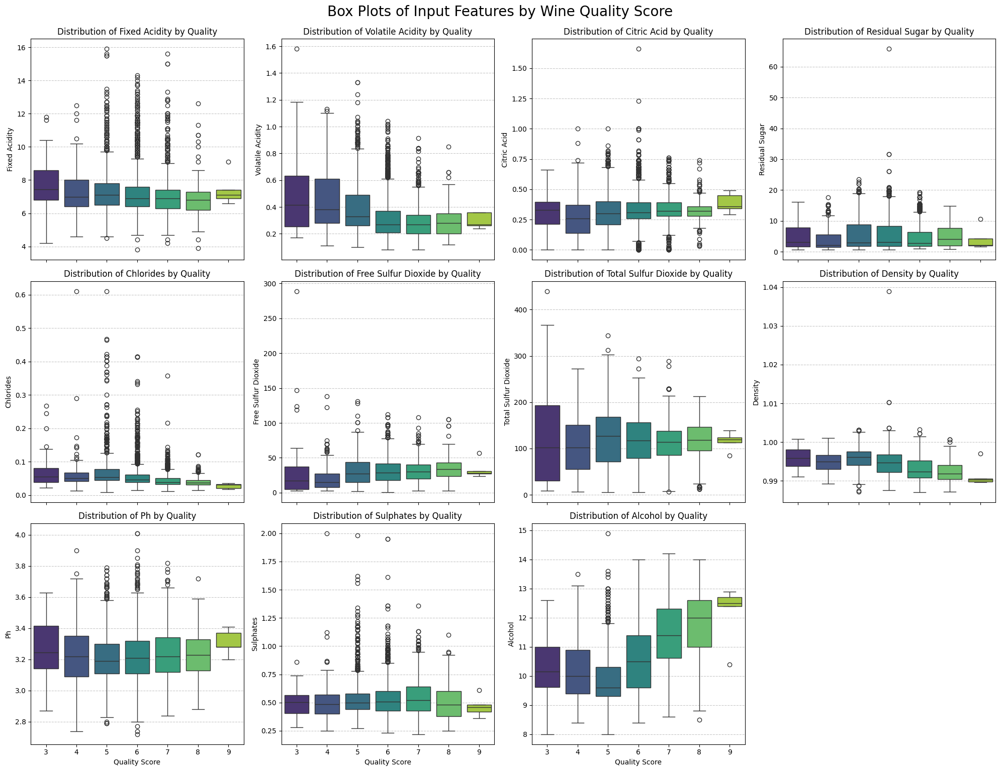
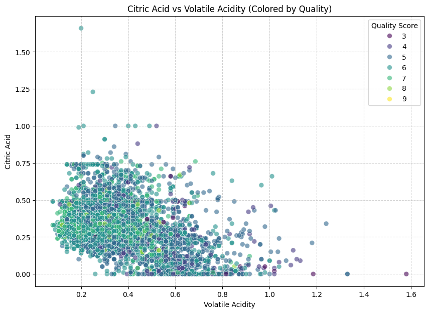

# 🧾 Assignment 1 – Ayoub ENOUJAI


---


N:APOGGEE : 22007782

## 👨‍🎓 Étudiant à l’ENCG Settat – Groupe 2 CAC  
**Spécialité : controle audit et conseil Gestion – Semestre 3**

---

# 🍷 Wine Quality Dataset

## 🧾 Overview
The **Wine Quality Dataset** is sourced from the [UCI Machine Learning Repository](https://archive.ics.uci.edu/dataset/186/wine+quality).  
It contains data on the **physicochemical properties** of *red* and *white* wines from the **Vinho Verde** region in northern Portugal.  
The dataset’s main goal is to explore the relationship between **objective chemical tests** and **subjective sensory quality ratings**.

---

## 📦 Dataset Summary

| Property | Description |
|-----------|-------------|
| **Name** | Wine Quality |
| **Source** | UCI Machine Learning Repository |
| **Region** | Vinho Verde (Northern Portugal) |
| **Datasets** | 2 (Red wine and White wine) |
| **Instances** | 1,599 (red) + 4,898 (white) |
| **Features** | 11 input variables + 1 output (quality) |
| **Task Type** | Regression or Classification |
| **Missing Values** | None |
| **License** | Creative Commons Attribution 4.0 (CC BY 4.0) |

---

## ⚗️ Input Variables (Physicochemical Tests)

| No. | Variable | Description |
|-----|-----------|-------------|
| 1 | `fixed_acidity` | Non-volatile acids such as tartaric and malic acids that do not evaporate easily. |
| 2 | `volatile_acidity` | Acetic acid content; high values can produce a vinegar taste. |
| 3 | `citric_acid` | Adds freshness and flavor; acts as a preservative. |
| 4 | `residual_sugar` | Amount of sugar left after fermentation; determines wine sweetness. |
| 5 | `chlorides` | Salt content in the wine. |
| 6 | `free_sulfur_dioxide` | SO₂ that can react with oxygen to prevent oxidation and microbial growth. |
| 7 | `total_sulfur_dioxide` | Sum of free and bound SO₂; excessive amounts can affect aroma. |
| 8 | `density` | Related to the sugar and alcohol content of the wine. |
| 9 | `pH` | Describes how acidic or basic a wine is (lower = more acidic). |
| 10 | `sulphates` | Contribute to sulfur dioxide levels; act as preservatives. |
| 11 | `alcohol` | Alcohol percentage by volume. |

---

## 🎯 Output Variable (Sensory Quality)

| Variable | Description |
|-----------|-------------|
| `quality` | Wine quality score between **0 and 10**, as rated by professional tasters. Usually ranges from **3 to 8**. |

---

## 🧠 Notes and Insights

- The `quality` variable is **ordinal** (higher = better), but **class distribution is imbalanced** — most wines are of medium quality.
- There are **no missing values**, making it suitable for both statistical and machine learning tasks.
- The dataset can be analyzed separately for **red** and **white** wines, or combined with an added categorical variable (`type`).
- Because taste is subjective, correlations between physicochemical variables and quality may be weak or nonlinear.

---

# 🧪 Wine Quality Analysis — Code Summary

This notebook analyzes the **Wine Quality dataset** (from the UCI Machine Learning Repository).  
You have already documented the dataset and its variables, so this summary focuses on the **code workflow and visualization process**.

---

## 📦 1. Importing and Fetching the Dataset

```python
!pip install ucimlrepo
from ucimlrepo import fetch_ucirepo

# Fetch dataset
wine_quality = fetch_ucirepo(id=186)

# Extract features and targets
X = wine_quality.data.features
y = wine_quality.data.targets

# Display metadata and variable info
print(wine_quality.metadata)
print(wine_quality.variables)


---

```

## 📦 2. Data presentation


This histogram visualizes the frequency of each wine quality score. You can see which scores are most common and the overall distribution of quality in the dataset.





THE CODE :

```python
import matplotlib.pyplot as plt
import seaborn as sns

# Create a histogram of the 'quality' scores
plt.figure(figsize=(10, 6))
sns.histplot(y['quality'], bins=range(0, 11), kde=False, color='skyblue', edgecolor='black')
plt.title('Distribution of Wine Quality Scores')
plt.xlabel('Quality Score')
plt.ylabel('Number of Wines')
plt.xticks(range(0, 11)) # Set x-ticks to represent each quality score
plt.grid(axis='y', alpha=0.75)
plt.show()
```


These box plots visualize the distribution of each physicochemical input feature across different wine quality scores. This can help identify which features tend to have higher or lower values for wines with better or worse quality, suggesting potential relationships between the features and the target variable.




THE CODE :
```python


import matplotlib.pyplot as plt
import seaborn as sns

# Combine features (X) and target (y) for easier plotting
# We need to reset the index of y to ensure proper concatenation
df_combined = pd.concat([X, y.reset_index(drop=True)], axis=1)

# Get the list of feature names
feature_names = X.columns

# Set up the figure and axes for subplots
# Determine grid size. For 11 features, 3x4 or 4x3 might be good.
# Let's go with 3 rows and 4 columns to accommodate all 11 features + one empty spot
fig, axes = plt.subplots(nrows=3, ncols=4, figsize=(20, 15), sharex=True)
axes = axes.flatten() # Flatten the 2D array of axes for easy iteration

# Iterate through each feature and create a box plot
for i, feature in enumerate(feature_names):
    sns.boxplot(x='quality', y=feature, data=df_combined, ax=axes[i], palette='viridis')
    axes[i].set_title(f'Distribution of {feature.replace("_", " ").title()} by Quality')
    axes[i].set_xlabel('Quality Score')
    axes[i].set_ylabel(feature.replace("_", " ").title())
    axes[i].grid(axis='y', linestyle='--', alpha=0.7)

# Remove any unused subplots
for j in range(len(feature_names), len(axes)):
    fig.delaxes(axes[j])

plt.tight_layout()
plt.suptitle('Box Plots of Input Features by Wine Quality Score', y=1.02, fontsize=20)
plt.show()

These scatter plots illustrate the relationship between two input features, with the points colored according to the wine quality score. This can reveal patterns, clusters, or trends where certain combinations of feature values are associated with higher or lower quality wines. For instance, you might observe regions in the plot where high-quality wines tend to cluster, indicating optimal ranges for these feature pairs.
```





THE CODE :
```python

import matplotlib.pyplot as plt
import seaborn as sns

# Ensure df_combined is available (it was created in a previous step for box plots)
# If it wasn't, uncomment and run the following line:
# df_combined = pd.concat([X, y.reset_index(drop=True)], axis=1)

# Plot 1: Alcohol vs Volatile Acidity colored by Quality
plt.figure(figsize=(10, 7))
sns.scatterplot(x='volatile_acidity', y='alcohol', hue='quality',
                data=df_combined, palette='viridis', s=50, alpha=0.6)
plt.title('Alcohol vs Volatile Acidity (Colored by Quality)')
plt.xlabel('Volatile Acidity')
plt.ylabel('Alcohol')
plt.legend(title='Quality Score')
plt.grid(True, linestyle='--', alpha=0.6)
plt.show()

# Plot 2: Citric Acid vs Volatile Acidity colored by Quality
plt.figure(figsize=(10, 7))
sns.scatterplot(x='volatile_acidity', y='citric_acid', hue='quality',
                data=df_combined, palette='viridis', s=50, alpha=0.6)
plt.title('Citric Acid vs Volatile Acidity (Colored by Quality)')
plt.xlabel('Volatile Acidity')
plt.ylabel('Citric Acid')
plt.legend(title='Quality Score')
plt.grid(True, linestyle='--', alpha=0.6)
plt.show()


This heatmap displays the pairwise correlation coefficients between all the features and the target variable ('quality').

Color Intensity: Stronger colors (closer to dark red or dark blue) indicate stronger correlations.
Color Hue: Red hues indicate positive correlations (as one variable increases, the other tends to increase), while blue hues indicate negative correlations (as one variable increases, the other tends to decrease).
Numbers: The annotated numbers are the correlation coefficients, ranging from -1 (perfect negative correlation) to 1 (perfect positive correlation), with 0 indicating no linear correlation.
This plot is useful for quickly identifying which features might be strongly predictive of wine quality, or which features are highly correlated with each other (which could indicate multicollinearity).


hese violin plots compare the distributions of each physicochemical feature for red versus white wines. Each plot shows the density estimation of the feature's values for each wine color, allowing you to easily see differences in median, spread, and overall shape of the distributions between the two types of wine. This can highlight features that are distinct characteristics of red or white wines.
```

!


